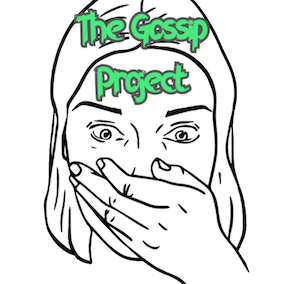

# The Gossip Project - Facebook Style
_l'app putasse_

<div style="text-align:center" align="center">
  
</div>

## Application

Réseau social de partage de potins, créé dans le cadre de The Hacking Project

## Installation

- Installez au préalable les gem  et dépendences.
  ```
  bundle install
  ```


- Exécutez le base de donnée sur votre ordinateur
  
  ```bash
  rails db:create #ou rails db:create:all #ou rake db:create:all
  rails db:migrate
  ```
  
 ## Améliorations possibles

- Optimisation graphique

- Choix de la photo de profil

- Un peu plus de putasseries

- Glow in the dark mode, et canards qui te suivent tout le temps 🦆🦆🦆


 ## Contributeurs

- [Stanislas BASQUIN](https://github.com/StanislasBASQUIN)
- [Vivien Ploix](https://github.com/Vivien-Ploix)
- [Mathieu JOLY](https://github.com/mathieu-superpose)

